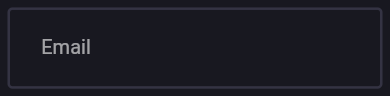

# Flutter Cheat Sheet

## SVG in flutter

Use the following package: `flutter_svg`

```dart
SvgPicture.asset(
    iconPath, // enter full path
    color: iconColor,
    width: 25,
),
```

## TextButton with Icon


```dart
TextButton.icon(
      onPressed: () {},
      icon: // type : widget
      // google icon
      label: Text('Continue with Google'),
      style: TextButton.styleFrom(
        padding: EdgeInsets.symmetric(
          vertical: 15,
          horizontal: horizontalPadding,
          // take horizontal padding from constructor
        ),
        shape: RoundedRectangleBorder(
          borderRadius: BorderRadius.circular(10),
          side: const BorderSide(
            width: 3,
            color: Colors.grey,
        ),
      ),
    ),
);
```

### To make the icon come right side, wrap the widget in `Directionality` widget and set textDirection

```dart
Directionality(
      textDirection: TextDirection.rtl, // this makes the icon go to right
      child: TextButton.icon(
      onPressed: () {},
      icon: // type : widget
      // google icon
      label: Text('Continue with Google'),
      style: TextButton.styleFrom(
        padding: EdgeInsets.symmetric(
          vertical: 15,
          horizontal: horizontalPadding,
          // take horizontal padding from constructor
        ),
        shape: RoundedRectangleBorder(
          borderRadius: BorderRadius.circular(10),
          side: const BorderSide(
            width: 3,
            color: Colors.grey,
        ),
      ),
    ),
);
)
```

## TextFormField



```dart
TextFormField(
    decoration: InputDecoration(
    hintText: 'Email',
    contentPadding: const EdgeInsets.all(27),
    enabledBorder: const OutlineInputBorder(
      borderSide: BorderSide(
        color: /*some border color*/,
        width: 2,
      ),
    ),
    focusedBorder: const OutlineInputBorder(
      borderSide: BorderSide(
        color: /*some gradient color for outline*/,
        width: 2,
      ),
    ),
  ),
),
```

## Google Sign In

```dart
signInWithGoogle() async {
    // begin interactive sign in process
    final GoogleSignInAccount? googleUser = await GoogleSignIn().signIn();
    // obtain auth details from request
    final GoogleSignInAuthentication gAuth = await googleUser!.authentication;
    // create a new credential for the user
    final credential = GoogleAuthProvider.credential(
        accessToken: gAuth.accessToken, idToken: gAuth.idToken);
    // finallyy, let's sign in
    UserCredential user =
        await FirebaseAuth.instance.signInWithCredential(credential);

    return user;
  }


  // signout
  signOut() async {
    await GoogleSignIn().disconnect();
    await FirebaseAuth.instance.signOut();
  }
```
